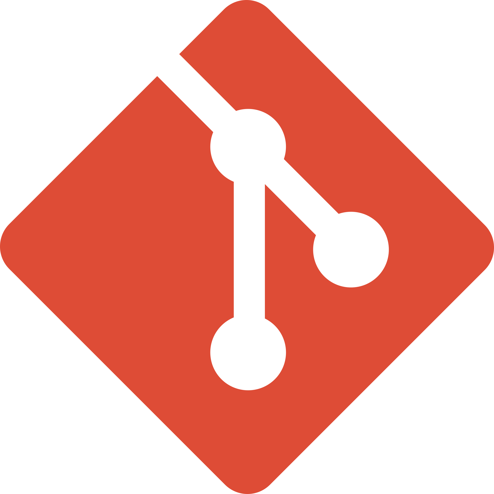
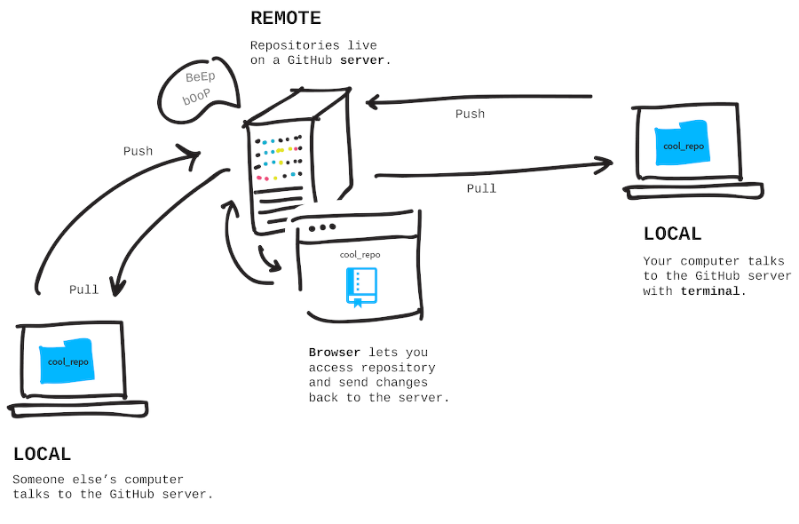
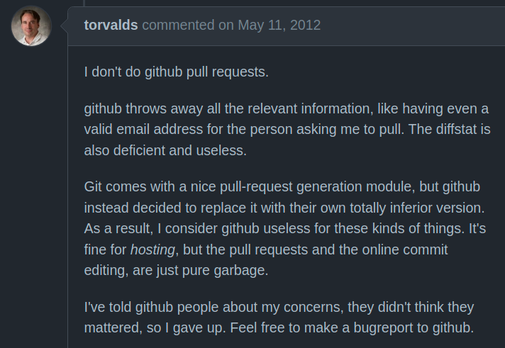
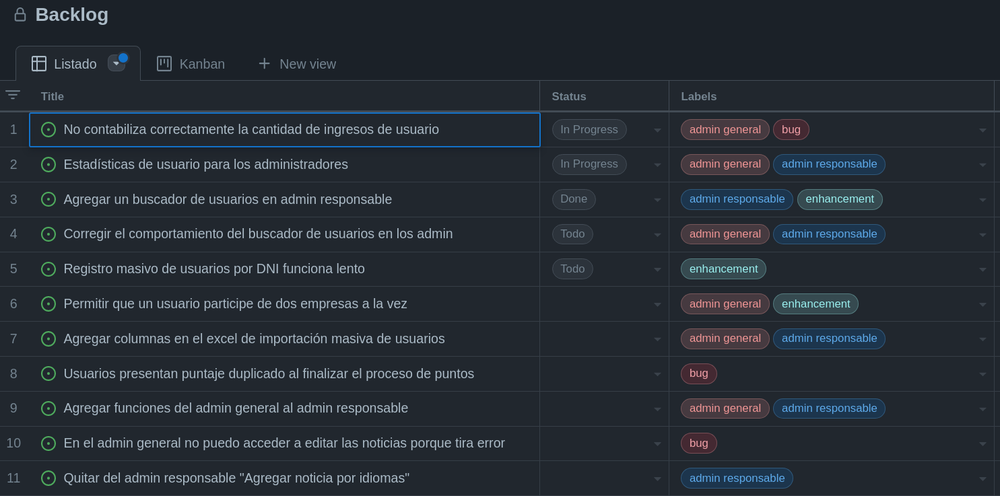

# Gestión de proyectos en GitHub


===

## ¿Qué es Git?

 <!-- .element height="200px" -->

--

Git es _solamente_ un programa para controlar **versiones de archivos**.

Resuelve el típico problema que tenemos al trabajar en equipo sobre un documento: **¿cuál es la última versión?**

--

- **1970: Sistema operativo Unix**
  - Privativo, con licencias para algunas instituciones.
- **1983: Proyecto GNU - _¡GNU is not Unix!_ 🐐**
  - Objetivo: desarrollar un SO 100% libre.
  - No tuvo éxito el kernel.
- **1991: Primera versión de Linux 🐧**
  - Desarrollado por Linus Torvalds, un finlandés de 21 años.
- **2005: Primera versión de Git**
  - Don Linus y amigues armaron su propio VCS.

--

|  <!-- .element: height="300px" --> |  <!-- .element: height="300px" --> |
| :-----------------------------------------------------: | :-------------------------------------------------------: |
|                 Richard Stallman (RMS)                  |                      Linus Torvalds                       |

 <!-- .element: height="150px" -->
 <!-- .element: height="150px" -->

--

Volviendo a **Git** (que de eso se trataba 😅), mencionemos sus características:

- **Rápido**
- Diseño **simple**
- Fuerte soporte para **desarrollo no lineal** (cientas de ramas en paralelo)
- Completamente **distribuido**
- Capaz de manejar **grandes proyectos** de forma eficiente (en velocidad y almacenamiento)

--

### Flujo básico de Git



--

⚠️⚠️⚠️

Git es _solamente_ un programa para controlar **versiones de archivos**.

⚠️⚠️⚠️

===

## ¿Qué es GitHub?

 <!-- .element: height="200px" -->

--

**Plataforma** que popularizó bastante Git. Surgió en 2008 y fue comprada por Microsoft en 2018.

En sus orígenes, no era más que un **repositorio remoto** de Git con cierto esfuerzo para que lo podamos usar lxs simples mortales.

--

Obviamente, a Linus no le gusta (o al menos no le gustaba en 2012):



--

De hecho, el desarrollo de Linux se sigue manejando por listas de mail como desde un comienzo.

```diff
diff --git a/mm/page_alloc.c b/mm/page_alloc.c
index 3589febc6d31928f85ddc40e0469f3..1804287c1b792b8aa0e964b17eb002b6b1115258 100644
--- a/mm/page_alloc.c
+++ b/mm/page_alloc.c
@@ -3706,10 +3706,10 @@ struct page *rmqueue(struct zone *preferred_zone,
 	 * allocate greater than order-1 page units with __GFP_NOFAIL.
 	 */
 	WARN_ON_ONCE((gfp_flags & __GFP_NOFAIL) && (order > 1));
-	spin_lock_irqsave(&zone->lock, flags);

 	do {
 		page = NULL;
+		spin_lock_irqsave(&zone->lock, flags);
 		/*
 		 * order-0 request can reach here when the pcplist is skipped
 		 * due to non-CMA allocation context. HIGHATOMIC area is
@@ -3721,15 +3721,15 @@ struct page *rmqueue(struct zone *preferred_zone,
 			if (page)
 				trace_mm_page_alloc_zone_locked(page, order, migratetype);
 		}
2.35.1.616.g0bdcbb4464-goog
```

<!-- .element: class="fullscreen" -->

--

Especialmente desde la compra por parte de M$, GitHub fue sumando varias herramientas de gestión y automatización de proyectos.

- **Issues**
- **Wiki**
- **Actions**
- **Projects**
- **Pages**

--

⚠️⚠️⚠️

GitHub es un **servidor remoto** de Git, que va camino a convertirse en una **plataforma** para el manejo de proyectos de software.

⚠️⚠️⚠️

===

## 🦾 Manos a la obra

Creemos un CV online.

- **Semilla:** https://github.com/surprograma/semilla-cv-jekyll
- **VScode online:** https://vscode.dev

--

Con este sencillo ejemplo, involucramos dos productos de GitHub: `Actions` y `Pages`.

Cuando hacemos un push a `main` (o `master`) se dispara un proceso (`Action`) que "compila" nuestra página y la pone online (`Pages`).

===

## Gestión de un proyecto

Además de tirar código, hay muchas otras tareas que hacemos en proyectos de software:

- Definir funcionalidades
- Asignar responsabilidades
- Proyectar avances
- Pensar y discutir con otrxs

--

Tener un _backlog_ o listado de tareas es tan importante como tener un equipo que pueda desarrollarlas.



--

GitHub tiene dos herramientas para esto:

- `Issues:` la más conocida.
- `Projects:` la más nueva y orientada a gestión.

===

## 🦾 Manos a la obra

Cargar issues y cerrarlas desde un commit.

===

## 🦾 Manos a la obra

Crear un project y draft issues.

===

# ¿Preguntas?

<div class="red-social">
  <i class="fab fa-youtube color"></i>
  <span><a href="https://youtube.com/c/elsurtambienprograma">El Sur también programa</a></span>
</div>
<div class="red-social">
  <i class="fab fa-telegram-plane color"></i>
  <span><a href="https://t.me/surprograma">@surprograma<a></span>
</div>
<div class="red-social">
  <i class="fab fa-instagram color"></i>
  <span><a href="https://instagr.am/surprograma">@surprograma<a></span>
</div>


