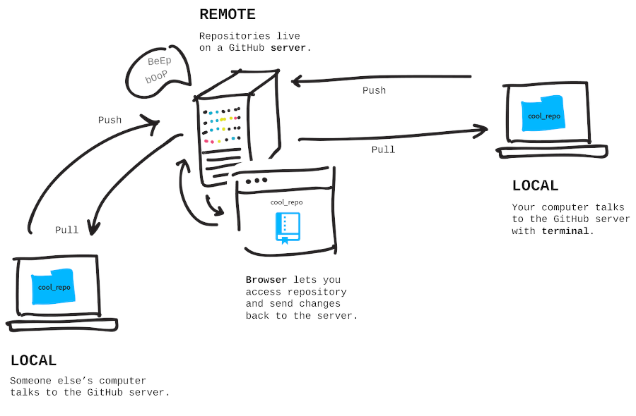
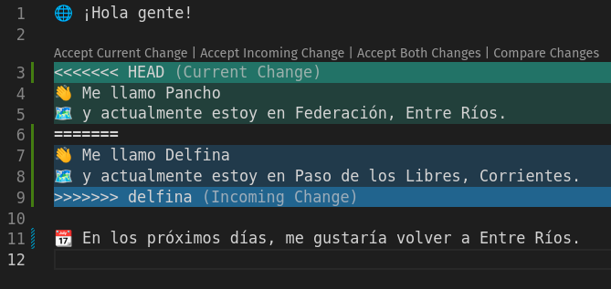

# Trabajo colaborativo en Git


===

## ¿Qué es Git?

 <!-- .element height="200px" -->

--

Git es _solamente_ un programa para controlar **versiones de archivos**.

Resuelve el típico problema que tenemos al trabajar en equipo sobre un documento: **¿cuál es la última versión?**

--

Principales características:

- **Rápido**
- Diseño **simple**
- Fuerte soporte para **desarrollo no lineal** (cientas de ramas en paralelo)
- Completamente **distribuido**
- Capaz de manejar **grandes proyectos** de forma eficiente (en velocidad y almacenamiento)

--

### Flujo básico de Git



--

Pero, ¿qué pasa cuando trabajamos con otrxs sobre un **mismo** proyecto?

👨‍💻 👩‍💻 💻 🧑‍💻 👩‍💻

===

## Trabajo colaborativo

Para trabajar en equipo necesitamos generar **acuerdos** mínimos sobre la forma de trabajo.

--

- ¿Cómo nos dividimos las tareas?
- ¿Qué convenciones utilizamos?
- ¿Cada cuánto _integramos_ el código?
- ¿Subimos código que no funciona?
- ¿Qué cosas testeamos?

Y un largo etcétera, que excede este taller...

--

Aunque muchas veces damos por sentado o minimizamos estos acuerdos, resultan ser incluso más importantes que cuestiones tecnológicas que podamos discutir posteriormente.

No hay herramienta que nos vaya a funcionar si no tenemos una **buena comunicación**. 🙊 🙉

<!-- .element: class="fragment" -->

===

## Aparecen los conflictos 😬

Tarde o temprano, llegará un momento en que dos personas meterán la mano sobre el mismo archivo...

Dando paso así a los tan temidos **conflictos de Git**.

--

<div style='position: relative; padding-bottom: 56.25%; padding-top: 35px; height: 0; overflow: hidden;'><iframe sandbox='allow-scripts allow-same-origin allow-presentation' allowfullscreen='true' allowtransparency='true' frameborder='0' height='315' src='https://www.mentimeter.com/app/presentation/3086d7d181a0f79217a93cfa6da45182/c023dc44ff59/embed' style='position: absolute; top: 0; left: 0; width: 100%; height: 100%;' width='420'></iframe></div>

--

Cuando estamos trabajando con alguien más y queremos integrar nuestros cambios, pueden darse tres situaciones:

1. Que hayamos tocado **diferentes archivos**. 👍
<!-- .element: class="fragment" -->

1. Que hayamos tocado los **mismos archivos**, pero en **distintos lugares**. 👍
<!-- .element: class="fragment" -->

1. Que hayamos tocado los **mismos archivos**, en los **mismos lugares**. 😱
<!-- .element: class="fragment" -->

--

Git puede lidiar **automáticamente** con las dos primeras situaciones, pero necesita intervención humana cuando ocurre la tercera.

A eso se lo conoce como **conflicto**, y por consola nos lo reporta así:

```shell
Auto-merging README.md
CONFLICT (content): Merge conflict in README.md
```

===

## Ocasionemos un conflicto

Partiendo de este archivo:

```md []
🌐 ¡Hola mundo!

👋 Me llamo _COMPLETAR_
🗺️ y actualmente estoy en _COMPLETAR_.

📆 En los próximos días, me gustaría _COMPLETAR_.
```

--

Vamos a asumir que Pancho y Delfina están trabajando, sin comunicarse entre sí, y realizan modificaciones.

```md []
🌐 ¡Hola gente!

👋 Me llamo Pancho
🗺️ y actualmente estoy en Federación, Entre Ríos.

📆 En los próximos días, me gustaría _COMPLETAR_.
```

```md []
🌐 ¡Hola mundo!

👋 Me llamo Delfina
🗺️ y actualmente estoy en Paso de los Libres, Corrientes.

📆 En los próximos días, me gustaría volver a Entre Ríos.
```

--

```diff
-🌐 ¡Hola mundo!
+🌐 ¡Hola gente!

-👋 Me llamo _COMPLETAR_
-🗺️ y actualmente estoy en _COMPLETAR_.
+👋 Me llamo Pancho
+🗺️ y actualmente estoy en Federación, Entre Ríos.

 📆 En los próximos días, me gustaría _COMPLETAR_.
```

¿Qué creen que ocurrirá al intentar hacer un _merge_?

<!-- .element: class="fragment" -->

```diff
 🌐 ¡Hola mundo!

-👋 Me llamo _COMPLETAR_
-🗺️ y actualmente estoy en _COMPLETAR_.
+👋 Me llamo Delfina
+🗺️ y actualmente estoy en Paso de los Libres, Corrientes.

-📆 En los próximos días, me gustaría _COMPLETAR_.
+📆 En los próximos días, me gustaría volver a Entre Ríos.
```

--

¡Bingo! 🎉

Va a ocurrir un **conflicto**, específicamente en las líneas 3 y 4, que fue las que ambxs modificaron.

El conflicto lo tendrá la última persona que integre los cambios, Pancho en este ejemplo.

===

## ¿Cómo se ve un conflicto?

Lo que Git hace es agregar unas **marcas** en el archivo, que nos indican **dónde ocurrió el conflicto**.

Luego, hay varios programas que muestran eso de distintas maneras.

--

En texto plano:

```text
🌐 ¡Hola gente!

<<<<<<< HEAD
👋 Me llamo Pancho
🗺️ y actualmente estoy en Federación, Entre Ríos.
=======
👋 Me llamo Delfina
🗺️ y actualmente estoy en Paso de los Libres, Corrientes.
>>>>>>> delfina

📆 En los próximos días, me gustaría volver a Entre Ríos.
```

--

Con el comando `git diff`:

```diff
index 977e95a,2aef011..0000000
--- a/README.md
+++ b/README.md
@@@ -1,6 -1,6 +1,11 @@@
-🌐 ¡Hola mundo!
+🌐 ¡Hola gente!

++<<<<<<< HEAD
+👋 Me llamo Pancho
+🗺️ y actualmente estoy en Federación, Entre Ríos.
++=======
+ 👋 Me llamo Delfina
+ 🗺️ y actualmente estoy en Corrientes.
++>>>>>>> delfina

- 📆 En los próximos días, me gustaría _COMPLETAR_.
+ 📆 En los próximos días, me gustaría volver a Entre Ríos.
```

<!-- .element: class="fullscreen" -->

<small>(Nótese que nos muestra también las partes que pudo integrar automáticamente.)</small>

--

Con un editor como el VScode:



--

Con el VScode también, pero en modo `Compare`:


===

## 🦾 Manos a la obra

Provoquen ustedes un conflicto, para ver cómo es.

Trabajando sobre el archivo `README.md`, hagan modificaciones y luego súbanlas al repositorio.

===

## 👀 Demostración

Vemos cómo resolverlo usando la consola.

===

## Estrategias para evitarlos

Si bien siempre aparecerán conflictos, podemos hacer varias cosas para **minimizar la probabilidad** de que ocurran:

1. Comunicarnos y dividir tareas 👍
<!-- .element: class="fragment" -->

1. Integrar rápido 👍
<!-- .element: class="fragment" -->

1. "Bloquear" archivos 🤮
<!-- .element: class="fragment" -->

--

De todas formas, aprender a resolver conflictos **es necesario** para el trabajo en, prácticamente, cualquier proyecto de programación.

===

## ¿Cómo resolverlos?

Cuando no queda otra, hay ciertas cosas que pueden ayudarnos a que la tarea sea más amena:

1. Hablar con la o las personas que modificaron el mismo archivo.
<!-- .element: class="fragment" -->

1. Usar buenas herramientas.
<!-- .element: class="fragment" -->

1. Tener una buena batería de tests automatizados.
<!-- .element: class="fragment" -->

--

En esencia, lo que hay que hacer es:

1. Dejar el archivo como queremos que quede.
1. Agregar el archivo y hacer un _commit_:

```bash
git add README.md # o directamente, git add .
git commit
```

En este caso no es necesario (ni recomendable) escribir el mensaje del commit. Git lo hará por nosotrxs.

===

## 🦾 Manos a la obra

Elijan quién es A y quién es B. Hagan lo que sigue, **en orden** y **hablando entre ustedes**.

|             |                                                                                              |
| ----------- | -------------------------------------------------------------------------------------------- |
| **Primero** | A edita el archivo A.md y sube. <br/> B edita el archivo A.md y sube, resuelve el conflicto. |
| **Después** | B edita el archivo B.md y sube. <br/> A edita el archivo B.md y sube, resuelve el conflicto. |

===

## 👀 Demostración

Vemos cómo resolverlo usando el VScode.

===

<div style='position: relative; padding-bottom: 56.25%; padding-top: 35px; height: 0; overflow: hidden;'><iframe sandbox='allow-scripts allow-same-origin allow-presentation' allowfullscreen='true' allowtransparency='true' frameborder='0' height='315' src='https://www.mentimeter.com/app/presentation/18d1d55422cda76da3554d6cce326516/8e35d5f6bad4/embed' style='position: absolute; top: 0; left: 0; width: 100%; height: 100%;' width='420'></iframe></div>

--

<div class="red-social">
  <i class="fab fa-youtube color"></i>
  <span><a href="https://youtube.com/c/elsurtambienprograma">El Sur también programa</a></span>
</div>
<div class="red-social">
  <i class="fab fa-telegram-plane color"></i>
  <span><a href="https://t.me/surprograma">@surprograma<a></span>
</div>
<div class="red-social">
  <i class="fab fa-instagram color"></i>
  <span><a href="https://instagr.am/surprograma">@surprograma<a></span>
</div>


